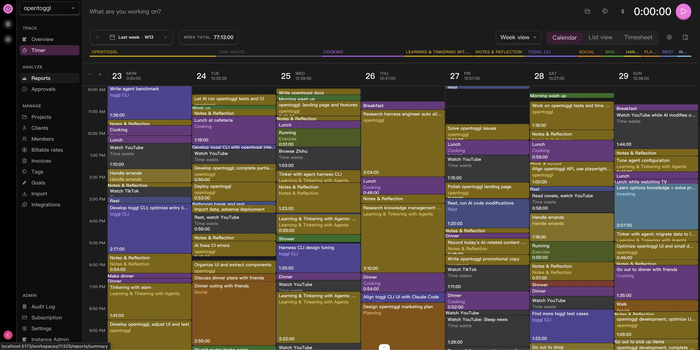

[中文](README.zh-CN.md)

  

# OpenTickly

OpenTickly is a free, private-first, AI-friendly alternative to Toggl.

Toggl is a great product, but it's expensive and your data doesn't really belong to you. On top of that, the 30 requests/hour API limit is painful — an AI agent can burn through an hour's quota in a single minute.

OpenTickly aims to stay aligned with Toggl, so you can move your data in and out between the two without any loss. Keep every workflow and habit you already have. Nothing changes — it just gets better, cheaper, and more private.

## AI Integration

OpenTickly works directly with [`toggl-cli`](https://github.com/CorrectRoadH/toggl-cli), so AI can help you record, manage, and review your time. Apply the Lyubishchev time management method to find the black holes in your day.

Read the full docs [here](https://opentoggl.com/docs/ai-integration).

## Self-Hosting

Deploy via Docker Compose on your own home server — NAS, CasaOS/ZimaOS, Synology, TrueNAS, and more.

[Read the self-hosting docs](https://opentoggl.com/docs/self-hosting)

## Mobile PWA Support

The web UI is an installable Progressive Web App (PWA). On mobile (iOS and Android) you can add it to your home screen and use it like a native app.

## Roadmap

- [x] Full API compatibility with Track v9 and Reports v3
- [ ] Full parity with Toggl Track web
- [x] Mobile PWA with offline support
- [ ] OpenTickly Focus
- [ ] OpenTickly Plan

## Get Started

- Repository: `https://github.com/CorrectRoadH/OpenTickly`
- Self-hosting docs: `./docs/self-hosting/docker-compose.md`
- CLI: `https://github.com/CorrectRoadH/toggl-cli`

## Acknowledgments

OpenTickly's design is inspired by [Toggl](https://toggl.com), and we aim to stay compatible with their product surface so you can keep your existing workflow.

We also thank [Linux Do](https://linux.do) for their support and feedback during the project's early development.

## Star History

<a href="https://www.star-history.com/?repos=CorrectRoadH%2FOpenTickly&type=date&legend=top-left">
 <picture>
   <source media="(prefers-color-scheme: dark)" srcset="https://api.star-history.com/chart?repos=CorrectRoadH/OpenTickly&type=date&theme=dark&legend=top-left" />
   <source media="(prefers-color-scheme: light)" srcset="https://api.star-history.com/chart?repos=CorrectRoadH/OpenTickly&type=date&legend=top-left" />
   
 </picture>
</a>
