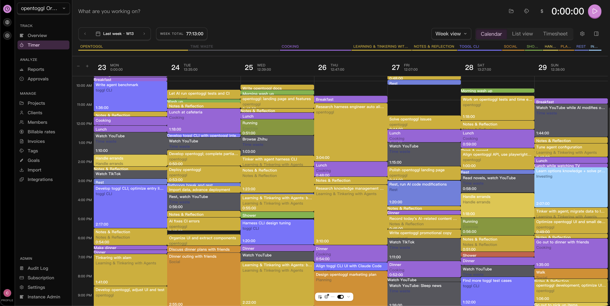

[English](README.md)

<p align="center">
  
</p>

# OpenToggl

OpenToggl 是一个免费、private-first、AI-friendly 的 Toggl 替代方案。

它存在的原因很简单：对很多个人和团队来说，Toggl 太贵；对重视数据掌控的人来说，它不够 private-first；对 AI 和自动化场景来说，它的 rate limit 又低得几乎无法真正使用。

OpenToggl 的目标是与 Toggl 的产品面保持一致，让你保留熟悉的工作流，同时把部署权、数据控制权和 API 吞吐量拿回来。



## 为什么是 OpenToggl

Toggl 能用，但当成本、控制权或自动化不再是可以妥协的事情时，它就不再合适了。

OpenToggl 就是为这个缺口而存在的。

- 免费，而不是持续叠加的订阅成本
- private-first，而不是把你的时间数据放在别人的基础设施上
- 可 self-host，而不是被单一厂商绑定
- 对 AI 友好，而不是被低 rate limit 卡死
- 目标是保留 Toggl 式工作流，而不是逼你学习另一套产品
- 更适合高频 API 使用，`30/hour` 对真正的 agent 和自动化来说远远不够

如果你想保留 Toggl 兼容的工作流，但不想接受它在价格压力、厂商绑定和 API 天花板上的约束，这就是 OpenToggl 的意义。

## 为 AI 而生

大多数时间追踪工具，默认都是为“人在浏览器里点按钮”设计的。但是 OpenToggl 为 agent 而诞生。可以通过[Toggl cli](https://github.com/CorrectRoadH/toggl-cli)让 AI 使用 OpenToggl。

AI 工作流需要高频读取项目、任务、标签、用户、报表和运行中的 timer，也需要持续创建和更新 time entry。它需要足够高的 HTTP 吞吐，才能成为真正可用的软件基础设施，而不是被微小 hourly limit 困住的 demo。

OpenToggl 是一个更适合 AI 的 toggl。

## Private-First

你的时间数据，本质上就是业务数据。

它记录了你做了什么、什么时候做、给谁做、团队的时间如何分配。这些数据应该可以部署在你自己控制的基础设施上。

OpenToggl 把 self-hosting 当成一等产品方向，而不是附带能力。

## 保留工作流，去掉约束

OpenToggl 不试图发明一种新的时间追踪哲学。

它的目标是尽可能与 Toggl 的产品面保持一致，这样切换过来不意味着你要重新培训团队、重写脚本，或者放弃原有习惯。

你保留工作流。
你去掉价格压力、厂商绑定和 API 天花板。

## 可与 `toggl-cli` 配合使用

OpenToggl 可以直接与 [`toggl-cli`](https://github.com/CorrectRoadH/toggl-cli) 配合使用，所以你可以把同一套 CLI 工作流指向自己的实例。

```shell
toggl auth <YOUR_API_TOKEN> --type opentoggl --api-url https://your-instance.com/api/v9
```

## 手机端 PWA 支持

Web UI 是一个可安装的 Progressive Web App (PWA)。在手机上（iOS 和 Android）可以添加到主屏幕，像原生 App 一样使用——支持离线、全屏独立模式、快速启动，无需应用商店。

## Roadmap

- [x] API 完全兼容 track v9 和 report v3
- [ ] track web 完全一致实现
- [x] 手机端 PWA，支持离线使用
- [ ] opentoggl focus
- [ ] opentoggl plan

## 开始使用

- 仓库：`https://github.com/CorrectRoadH/opentoggl`
- Self-hosting 文档：`./docs/self-hosting/docker-compose.md`
- CLI：`https://github.com/CorrectRoadH/toggl-cli`

## 致谢

OpenToggl 的设计灵感来源于 [Toggl](https://toggl.com)，我们致力于与其产品面保持兼容，让您可以保留原有的工作流程。

同时感谢 [Linux Do](https://linux.do) 在项目早期开发阶段提供的支持与反馈。
